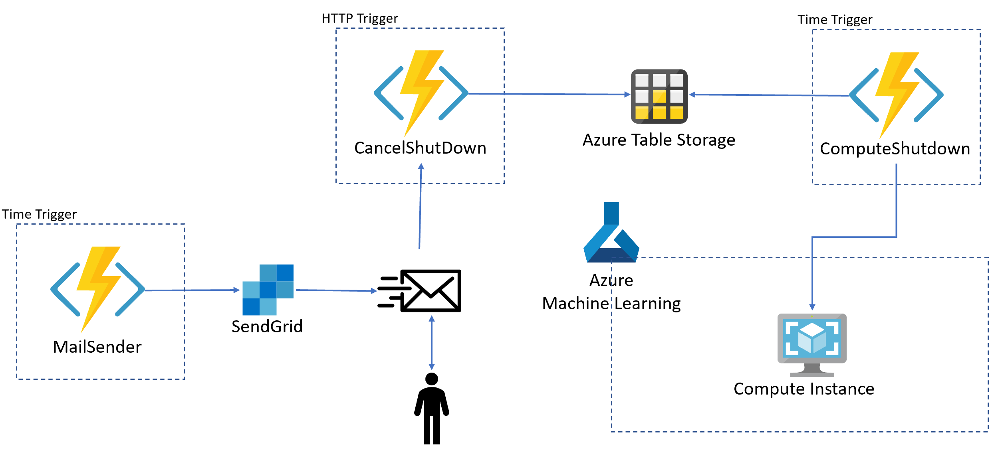

# Azure Machine Learning 

### Architecture

* MailSender  
  - Trigger: Time Trigger
  - Action: Send mail to a user with a link to avoid Compute Instance shutdown
  - Services: SendGrid

* CancelShutDown  
  - Trigger: HTTP Trigger
  - Action: Add an entry on Azure Table Storage to cancel compute instance shutdown, triggered by user interaction with mail
  - Services: Azure Table Storage

* ComputeShutdown  
  - Trigger: Time Trigger
  - Action: Perform compute instance shutdown if no entry is found in the Azure Table Storage
  - Services: Azure Table Storage, Azure Machine Learning

# How To Get Started

## Create a Service Principal
Create a Azure Service Principal to access the workspace as Contributor role

* [Create a Service Principal](https://docs.microsoft.com/en-us/azure-stack/operator/azure-stack-create-service-principals?view=azs-2002)
* [Grant Access to Azure Machine Learning Workspace](https://docs.microsoft.com/en-us/azure/role-based-access-control/role-assignments-portal)

## Deploy the solution
Clone the git repo  
Open it with Visual Code  
Deploy the Azure Functions as described in the following link  
* [Deploy an Azure Functions in Python](https://docs.microsoft.com/en-us/azure/developer/python/tutorial-vs-code-serverless-python-05)

## Configure the solution
Use the following link to configure the App Settings:

* AzureWebJobsStorage 
  - Connection string to Azure Blob Storage for Azure Functions configuration  
* FUNCTIONS_WORKER_RUNTIME
  - Keep it as "python"
* tenant_id
  - Your Azure Active Direcotry Tenant Id
* subscription_id
  - Your Azure Subscription Id
* service_principal_id
  - Your Azure Service Principal Id ([see this link](https://docs.microsoft.com/en-us/azure-stack/operator/azure-stack-create-service-principals?view=azs-2002))
* service_principal_password
  - Yout Azure Service Principal Password ([see this link](https://docs.microsoft.com/en-us/azure-stack/operator/azure-stack-create-service-principals?view=azs-2002))
* resource_group
  - Your Azure Machine Learning Workspace Resource Group
* aml_workspace
  - Your Azure Machine Learning Workspace name
* aml_compute_instance
  - The Compute Instance name you want to shutdown

* SENDGRID_API_KEY
  - Your SendGrid account key ([see this link](https://sendgrid.com/docs/for-developers/partners/microsoft-azure/))
* func_cancel_shutdown
  - The link to your Azure Functions to shutdown the Compute Instance ([see this link](https://docs.microsoft.com/en-us/azure/azure-functions/functions-create-first-function-vs-code?pivots=programming-language-python#run-the-function-in-azure))
* from_email
  - Email sender
* to_emails
  - Mail user to be notified
* subject
  - Mail subject to be sent

* [Configure App settings for Azure Functions](https://docs.microsoft.com/en-us/azure/azure-functions/functions-how-to-use-azure-function-app-settings)
* [Getting Started with Azure Functions](https://docs.microsoft.com/en-us/azure/azure-functions/functions-create-first-function-vs-code?pivots=programming-language-python#run-the-function-in-azure)